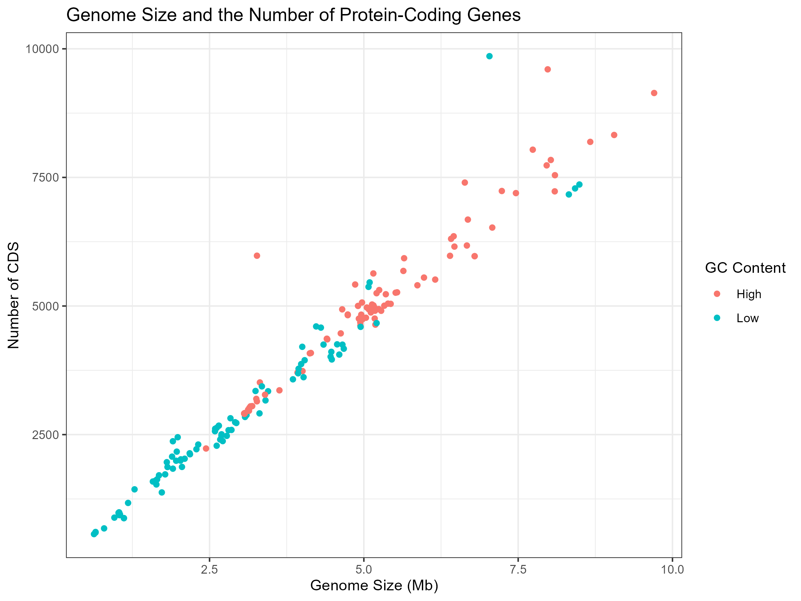

# Bacterial Genome Size Analysis

## Overview

An R-based analysis investigating the relationship between **bacterial genome size** and **protein-coding gene number (CDS)** across 200 complete bacterial genomes from **BV-BRC**.

## Research Question

**Is bacterial genome size associated with the number of protein-coding genes?**

## Methods

* Data retrieval from the BV-BRC API
* Data preprocessing and transformation
* Exploratory data visualization
* Pearson correlation
* Linear regression
* Regression diagnostics
* Cook's distance analysis

## Results

A very strong positive association was observed between genome size and CDS count.

* **Pearson's r:** 0.9751
* **R²:** 0.9507
* **p-value:** < 2.2 × 10⁻¹⁶
* **n:** 200

Genome size explained approximately **95.1% of the variation in CDS count** in this dataset.

## Visualization



## Tools

**R • httr2 • dplyr • ggplot2 • plotly**

## Project Structure

```text
bacterial-genome-size-analysis/
├── genome_analysis.R
├── genome_size_vs_CDS.png
└── README.md
```

## Author

**Ali Moubed**
